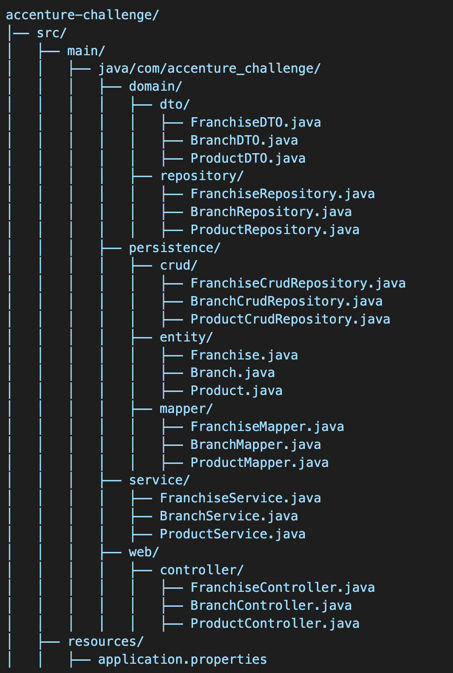
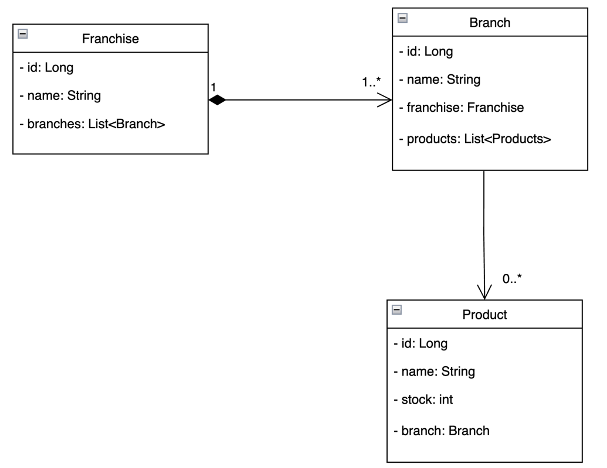
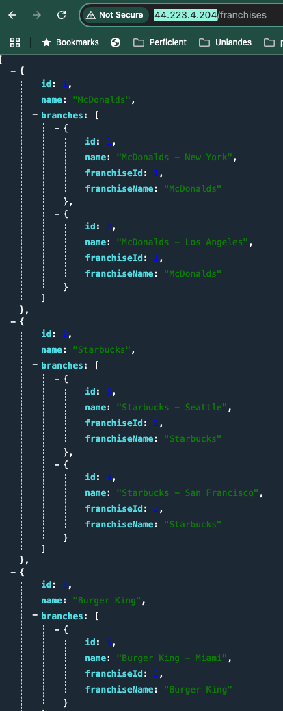

# Accenture Challenge
Este proyecto es una API REST desarrollada en Spring Boot para la gestión de franquicias, sucursales y productos. Permite la administración de stock y consulta de productos con mayor disponibilidad por sucursal.

## Arquitectura
Arquitectura en capas orientada al dominio. Este tipo de arquitectura permite desacoplar la solución de la capa de persistencia y delegar la responsabilidad al dominio.
Es eficiente en cuanto a que si nuestro motor de BD cambia o se agrega una nueva tabla no genere mayor impacto en nuesta aplicación.

## Estructura del proyecto

## UML

## Ejecución en ambiente local

### Clonar el repositorio

git clone https://github.com/tu-repositorio/accenture-challenge.git

### Configurar la base de datos en application.properties

spring.datasource.url=jdbc:postgresql://localhost:5432/accenture_market 
spring.datasource.username=postgres  
spring.datasource.password=admin

### Seeder

### Schema

-- Ensure the schema exists
CREATE SCHEMA IF NOT EXISTS franchises;  

-- Create the franchise table  
CREATE TABLE IF NOT EXISTS franchises.franchise (  
id SERIAL PRIMARY KEY,  
name VARCHAR(255) NOT NULL  
);

-- Create the branch table  
CREATE TABLE IF NOT EXISTS franchises.branch (  
id SERIAL PRIMARY KEY,  
name VARCHAR(255) NOT NULL,  
franchise_id INT NOT NULL,  
FOREIGN KEY (franchise_id) REFERENCES franchises.franchise (id) ON DELETE CASCADE
);

-- Create the product table  
CREATE TABLE IF NOT EXISTS franchises.product (  
id SERIAL PRIMARY KEY,  
name VARCHAR(255) NOT NULL,  
stock INT DEFAULT 0 NOT NULL,  
branch_id INT NOT NULL,  
FOREIGN KEY (branch_id) REFERENCES franchises.branch (id) ON DELETE CASCADE
);

### Data inicial

INSERT INTO franchises.franchise (name) VALUES  
('McDonald\'s'),  
('Starbucks'),  
('Burger King'),  
('KFC'),  
('Subway');  

INSERT INTO franchises.branch (name, franchise_id) VALUES  
('McDonald\'s - New York', 1),  
('McDonald\'s - Los Angeles', 1),  
('Starbucks - Seattle', 2),  
('Starbucks - San Francisco', 2),  
('Burger King - Miami', 3),  
('KFC - Texas', 4),  
('Subway - Chicago', 5);  

INSERT INTO franchises.product (name, stock, branch_id) VALUES  
('Big Mac', 50, 1),  
('Fries', 200, 1),  
('McFlurry', 75, 1),  
('Latte', 100, 3),  
('Espresso', 150, 3),   
('Chicken Sandwich', 80, 6),  
('Whopper', 60, 5),  
('Veggie Wrap', 90, 7),  
('Chicken Nuggets', 120, 6); 

# Respuesta a cada requerimiento

## 2. Exponer endpoint para agregar una nueva franquicia.

POST {{base_url}}/franchises

Body:  
{
"name": "Crepes and Waffles",
"branches": []
}

Verify with:  
**GET {{base_url}}/franchises**

## 3. Exponer endpoint para agregar una nueva sucursal a una franquicia.

**POST {{base_url}}/branches/{franchiseId}**  
Body:  
{
"name": "Sucursal Nueva",
"franchiseId": 1,
"franchiseName": "McDonalds - New York"
}

Verify with:  
**GET {{base_url}}/branches/franchise/{franchiseId}**

## 4. Exponer endpoint para agregar un nuevo producto a una sucursal.

**POST {{base_url}}/products**  
Body:  
{
"name": "Burger",
"stock": 100,
"branchId": 1,
"branchName": "McDonalds - New York"
}

Verify with:  
**GET {{base_url}}/products/branch/{branchId}**

## 5. Exponer endpoint para eliminar un nuevo producto a una sucursal.
DELETE {{base_url}}/products/{productId}

## 6. Exponer endpoint para modificar el stock de un producto.
**PUT {{base_url}}/products/1/stock/{newStock}**

Verify with:  
**GET {{base_url}}/products/{productId}**

## 7. Exponer endpoint que permita mostrar cual es el producto que más stock tiene por sucursal para una franquicia puntual. Debe retornar un listado de productos que indique a que sucursal pertenece.
**GET {{base_url}}/products/top-stocked/franchise/{productId}**

## NOTA: 
* En la raíz del proyecto se encuentra una colección de POSTMAN para llevar a cabo las pruebas de la API
* La aplicación se encuentra desplega en la dirección: http://44.223.4.204/
## Evidencia: 
